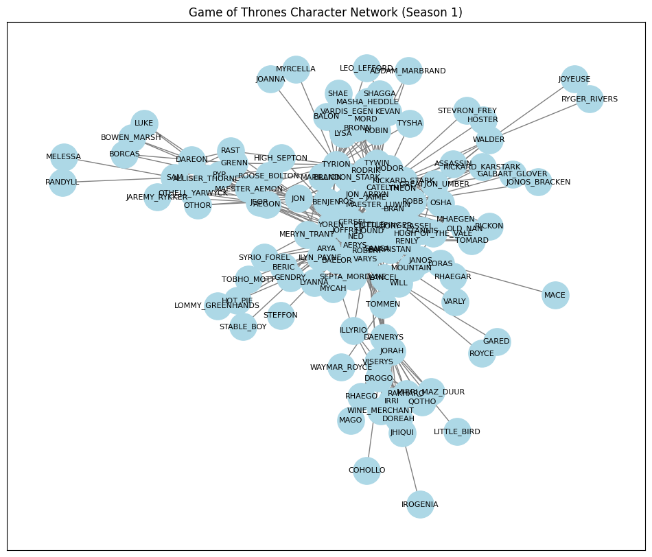
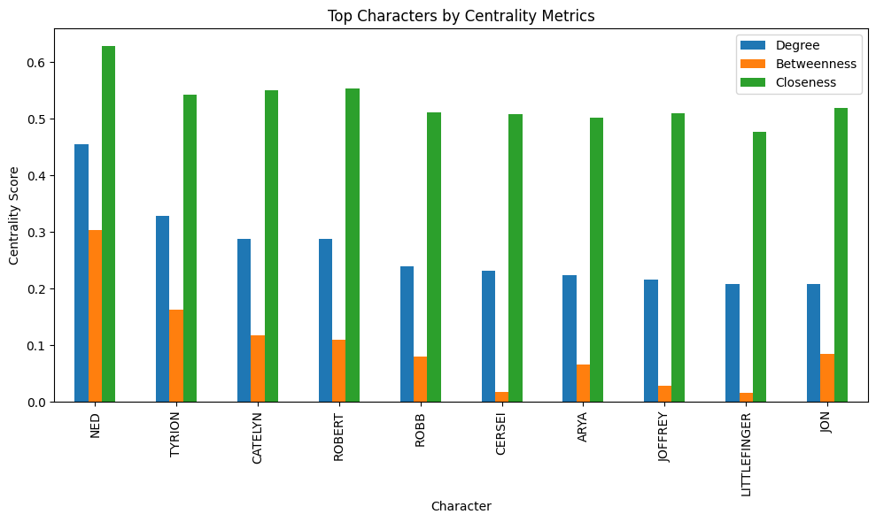
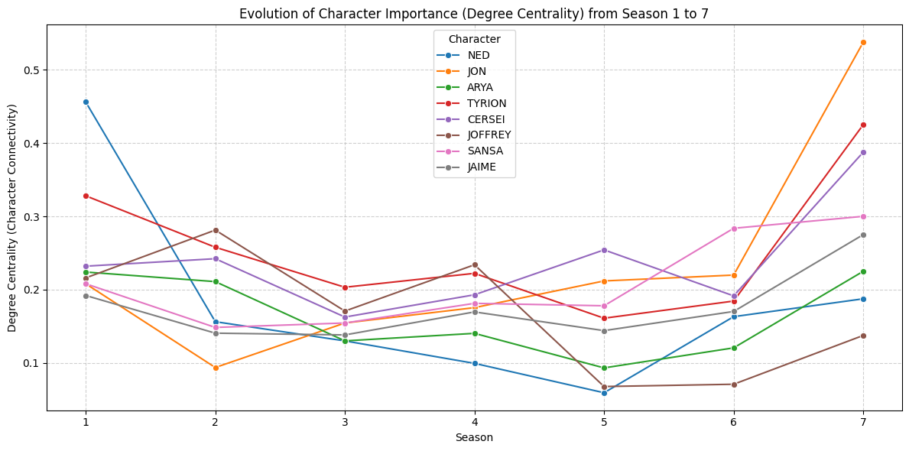
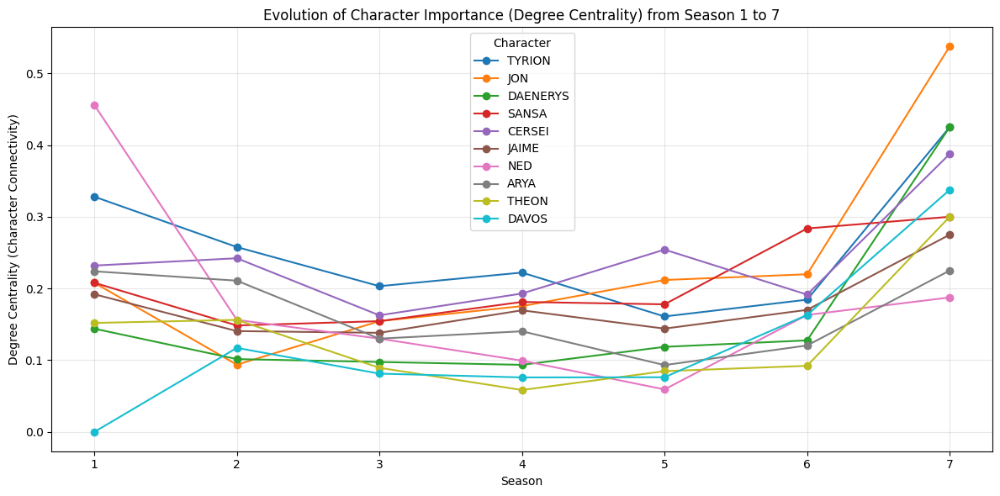

# Social-Network-Analysis-of-Games-of-throne-s-characters
This project explores how narrative influence evolves across seasons in the Game of Thrones universe using Social Network Analysis (SNA). We construct dynamic interaction networks of characters and analyze how their relationships shift from Season 1 to Season 7.

### 🎯 Key Features
- **Multi-season Network Analysis**: Analyze character interactions across all 7 seasons
- **Centrality Metrics**: Calculate degree, betweenness, and closeness centrality
- **Interactive Visualizations**: Create dynamic network graphs using PyVis
- **Narrative Importance Score (NIS)**: Novel metric combining multiple centrality measures
- **Temporal Analysis**: Track character importance evolution over time

## 🚀 Quick Start

### Prerequisites
```bash
pip install pandas networkx matplotlib pyvis seaborn
```

### Installation
```bash
git clone https://github.com/yourusername/got-network-analysis.git
cd got-network-analysis
jupyter notebook SNA__1_.ipynb
```

## 📈 Analysis Overview

### 1. Data Collection & Preprocessing
The analysis uses the Game of Thrones character interaction dataset from [Andrew Beveridge's repository](https://github.com/mathbeveridge/gameofthrones), containing weighted edges representing character co-appearances in scenes.

```python
# Data structure example
Source | Target | Weight | Season
-------|--------|--------|--------
Jon    | Sam    | 24     | 1
Tyrion | Cersei | 36     | 1
```

### 2. Network Construction
We build undirected weighted graphs for each season using NetworkX, where:
- **Nodes**: Characters
- **Edges**: Co-appearances
- **Weights**: Frequency of interactions

  

## 📊 Visualizations

### Season 1 Character Network

*Character interaction network for Season 1, showing the complex web of relationships*

### Interactive Network Visualization

*Interactive PyVis visualization allowing zoom, pan, and node exploration*

## 🔍 Key Findings

### Top 10 Most Central Characters (Season 1)

| Rank | Character | Degree Centrality | Betweenness Centrality | Closeness Centrality |
|------|-----------|-------------------|------------------------|----------------------|
| 1 | NED | 0.456 | 0.206 | 0.628 |
| 2 | TYRION | 0.328 | 0.099 | 0.543 |
| 3 | CATELYN | 0.288 | 0.072 | 0.551 |
| 4 | ROBERT | 0.288 | 0.080 | 0.553 |
| 5 | ROBB | 0.240 | 0.068 | 0.512 |
| 6 | CERSEI | 0.232 | 0.070 | 0.508 |
| 7 | ARYA | 0.224 | 0.042 | 0.502 |
| 8 | JOFFREY | 0.216 | 0.043 | 0.510 |
| 9 | LITTLEFINGER | 0.208 | 0.027 | 0.477 |
| 10 | JON | 0.208 | 0.030 | 0.519 |

### Narrative Importance Score (NIS)
Our innovative NIS metric combines multiple centrality measures:
```
NIS = 0.5 × Degree + 0.3 × Betweenness + 0.2 × Closeness
```

### Top Characters by NIS

*Characters ranked by their Narrative Importance Score*

## 📉 Character Evolution Analysis

### Centrality Over Time

*Evolution of character importance from Season 1 to 7*

Key observations:
- **Jon Snow**: Steady rise in importance, peaking in later seasons
- **Daenerys**: Gradual increase with significant spike in Season 6-7
- **Ned Stark**: High initial importance, dramatic drop after Season 1
- **Tyrion**: Consistently high importance throughout all seasons

## 🛠️ Methodology

### Centrality Metrics Explained

1. **Degree Centrality**: Measures direct connections
   - *Interpretation*: Characters with many interactions
   
2. **Betweenness Centrality**: Measures bridge positions
   - *Interpretation*: Characters connecting different groups
   
3. **Closeness Centrality**: Measures network accessibility
   - *Interpretation*: Characters central to the overall narrative

### NIS vs Degree centrality

*Comparative analysis of metrics across characters*

## 💡 Insights & Applications

### Strategic Insights
- **Power Dynamics**: Network structure reveals informal power hierarchies
- **Narrative Arcs**: Centrality changes predict character fate
- **Alliance Patterns**: Community detection identifies faction loyalties

### Business Applications
This methodology can be applied to:
- Customer network analysis
- Organizational hierarchy mapping
- Social media influence detection
- Supply chain optimization

## 🔬 Technical Details

### Performance Metrics
- **Processing Time**: ~2 seconds per season
- **Memory Usage**: < 100MB for full dataset
- **Scalability**: Handles networks with 100+ nodes efficiently

### Algorithm Complexity
| Algorithm | Time Complexity | Space Complexity |
|-----------|----------------|------------------|
| Degree Centrality | O(V) | O(V) |
| Betweenness | O(V³) | O(V²) |
| Closeness | O(V²) | O(V) |


## 👥 Contributing

Contributions are welcome! Please feel free to submit a Pull Request. For major changes, please open an issue first to discuss what you would like to change.

### How to Contribute
1. Fork the repository
2. Create your feature branch (`git checkout -b feature/AmazingFeature`)
3. Commit your changes (`git commit -m 'Add some AmazingFeature'`)
4. Push to the branch (`git push origin feature/AmazingFeature`)
5. Open a Pull Request

## Team Work
- Trisha Sharma
- Anahita Bhandari
  

